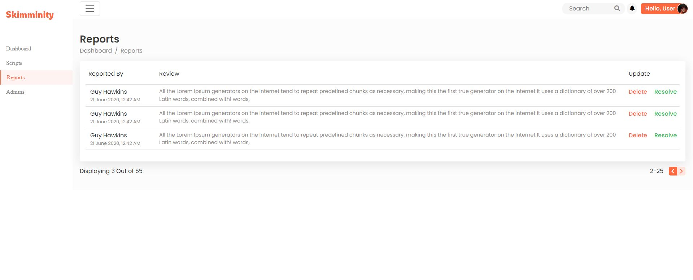
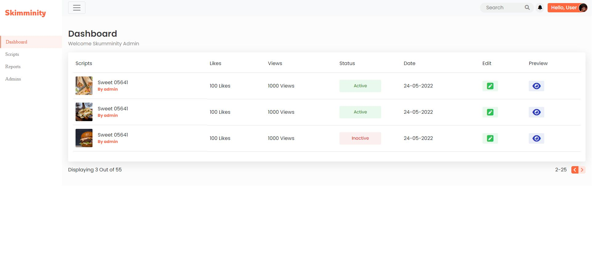
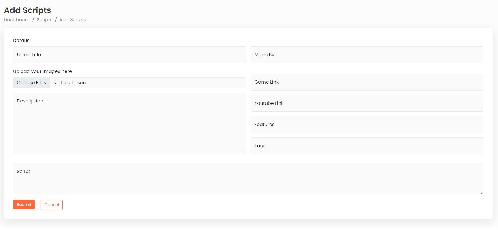

# Admin-Dashboard with Bootstrap

It is an html, css and javascript web-project built with tools like bootstrap, parcel (npm package), font-awesome, etc.\
It has 8+ pages, 3000+ lines of code, support for mobile devices and alot of DOM manipulation with Javascript.\
Check it out here => https://adnan-s-husain.github.io/Admin-Dashboard/ \
This is one of my first projects ever as a freelancer😎 where I worked with the Skumminity Team.

## Here's how it looks-like

## How to Run the project on your Device

Its super easy to run this. Just download the files and open index.html in any browser.
